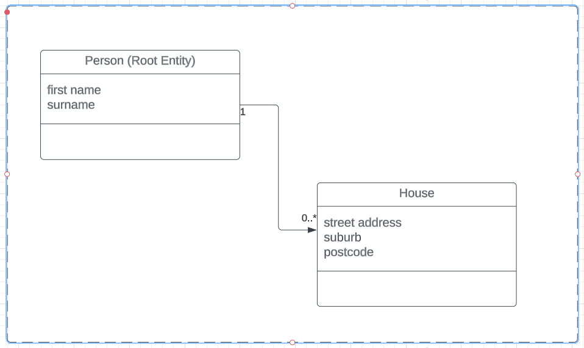

# Homeowners Spring  Boot Application
This application demonstrates how to model Entities and Value Objects.

The application is based on the following model: 

There are two branches in this repo:

- The _main_ branch shows a JPA version for persistence
- The _spring-data-jdbc_ branch uses Spring-Data-JDBC for persistence

## How to run the application

2. Start the Postgres docker container using `docker-compose up -d`
2. Run the application using `./gradlew bootRun`

## Sample requests
The `homeowners example.postman_collection.json` postman collection contains sample calls that can be made to the API. 